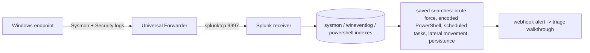

# SplunkHarbor

[](https://github.com/boluwajioadepojuw/SplunkHarbor/actions/workflows/ci.yml)

A Splunk SIEM lab that stands up on one Linux machine. Docker Compose
deployment, scripted forwarder setup, and a working ingestion path for
Windows endpoint logs.

## What you get

Start the compose stack, open Splunk, and query the incoming events.
Every machine you point the forwarder at shows up in the index: logons,
process starts, PowerShell activity, DNS lookups. All of it searchable
in one place.

## Where each part runs

- Splunk receiver: Linux, Docker (this machine)
- Windows endpoint: via deploy-forwarder.ps1 when a Windows box is available
- Demo data in the screenshots: Windows-shaped events (Sysmon/Security) sent
  to the HTTP Event Collector from the Linux lab machine

## Log sources

- **Sysmon**: process, network, file, registry, and DNS telemetry
  (event IDs 1, 3, 7, 8, 10, 11, 13, 22, 25) -> sysmon index
- **Windows Security**: authentication and account-management events
  (4624, 4625, 4672, 4688, 4720, 4728, 1102) -> wineventlog index

## What is inside

- `docker-compose.yml`: the full Splunk stack, one command to start; it
  mounts `configs/logharbor/local` into the receiver app
- `setup/`: install and configuration scripts
  - `install-splunk.sh`: unattended Splunk Enterprise install
  - `configure-inputs.sh`: deploys the repo config into the app
  - `deploy-forwarder.ps1`: Windows endpoint forwarder deployment
- `docs/`: a step-by-step guide from first login to writing SPL
  detections
- `configs/logharbor/local/`: inputs, props/transforms (parsing and
  index routing), indexes and the five saved searches (with the
  brute-force webhook alert)
- `spl/`: the five detections as standalone SPL plus the triage
  walkthrough

## Quick start

```bash
cp .env.example .env    # set LH_PASSWORD (8+ chars)
docker compose up -d
```

Splunk Web listens on port 8000 (admin / your LH_PASSWORD). Compose
refuses to start when LH_PASSWORD is unset, so there is no default
password to guess. Give Splunk a few minutes for the first boot.

## The five detections

| Search | Index | Source | What it catches |
| --- | --- | --- | --- |
| brute-force.spl | wineventlog | Security 4625 | failed logons clustered per source |
| encoded-powershell.spl | sysmon | Sysmon 1 | -EncodedCommand / -enc command lines |
| scheduled-tasks.spl | sysmon | Sysmon 1 | schtasks /create executions |
| lateral-movement.spl | wineventlog | Security 5140 | network share access attempts |
| persistence.spl | sysmon | Sysmon 13 | Run key and startup folder writes |

A note on field names: the searches coalesce `src_ip`/`IpAddress` and
`user`/`SubjectUserName` so they return rows with or without the
Splunk Add-on for Windows installed, and the lateral-movement search
uses 5140 (share access) where `ShareName` actually exists.

## What it proves

Splunk administration basics, Windows log collection, SPL searches
against real endpoint telemetry, and alert wiring via webhook. The SIEM
skills every junior SOC posting asks for.

## Author

Boluwaji Oluwaseyi Adepoju

## License

MIT

## Screenshots

Live Splunk from the compose stack (splunk/splunk:9.4, captured 01/10/2026):

- [The five detection searches running in the live instance](screenshots/splunkharbor-splunk-searches.png)
- [Security overview dashboard](screenshots/splunkharbor-dashboard.png)
- [Endpoint threat dashboard](screenshots/splunkharbor-dashboard-endpoint.png)
- [Access and lateral movement dashboard](screenshots/splunkharbor-dashboard-access.png)

## Related projects

- [SOCAtelier](https://github.com/boluwajioadepojuw/SOCAtelier) - the SOC lab console that consumes the same telemetry
- [SigScope](https://github.com/boluwajioadepojuw/SigScope) - ATT&CK coverage gate for the Sigma rules behind these detections
- [IocVerdict](https://github.com/boluwajioadepojuw/IocVerdict) - IOC enrichment for the indicators these alerts surface
- [DomainSieve](https://github.com/boluwajioadepojuw/DomainSieve) - gateway rules from newly registered domains
- [ArpSieve](https://github.com/boluwajioadepojuw/ArpSieve) - ARP spoofing detection on the local segment

## Data flow


