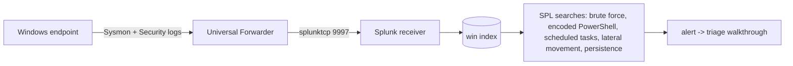

# SplunkHarbor

A Splunk SIEM lab that stands up on one Linux machine. Docker Compose
deployment, scripted forwarder setup, and a working ingestion path for
Windows endpoint logs.

## What you get

Start the compose stack, open Splunk, and query the incoming events.
Every machine you point the forwarder at shows up in the index: logons,
process starts, PowerShell activity, DNS lookups. All of it searchable
in one place.

## Log sources

- **Sysmon**: process, network, file, registry, and DNS telemetry
  (event IDs 1, 3, 7, 8, 10, 11, 13, 22, 25)
- **Windows Security**: authentication and account-management events
  (4624, 4625, 4672, 4688, 4720, 4728, 1102)

## What is inside

- `docker-compose.yml`: the full Splunk stack, one command to start
- `setup/`: install and configuration scripts
  - `install-splunk.sh`: unattended Splunk Enterprise install
  - `configure-inputs.sh`: index and input configuration
  - `deploy-forwarder.ps1`: Windows endpoint forwarder deployment
- `docs/`: a step-by-step guide from first login to writing SPL
  detections
- `configs/`: ready-to-use Splunk app configuration

## Quick start

```bash
docker compose up -d
```

Splunk Web listens on port 8000. The default credentials are in the
compose environment file. Give Splunk a few minutes for the first boot.

## What it proves

Splunk administration basics, Windows log collection, and SPL searches
against real endpoint telemetry. The SIEM skill every junior SOC
posting asks for.

## Author

Boluwaji Oluwaseyi Adepoju

## License

MIT

## Screenshots

Live Splunk from the compose stack (splunk/splunk:9.4, captured 01/10/2026):

- [Splunk login](screenshots/splunkharbor-splunk-login.png)
- [Splunk home after login](screenshots/splunkharbor-splunk-home.png)
- [Rendered README](screenshots/splunkharbor-readme.png)
- [Deployment validation: compose config + script syntax](screenshots/splunkharbor-validation.png)
- [SPL detection content](screenshots/splunkharbor-spl.png)

## Data flow


