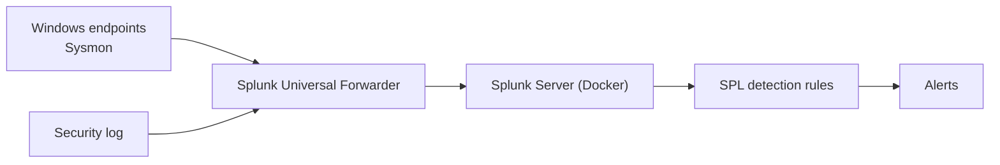

# Learning Guide

This guide is written for someone starting out in security operations.
No prior SIEM experience needed. By the end you should understand how
the pieces of a security monitoring pipeline fit together, and have a
clear path through this lab.

---

## What is a SIEM?

A SIEM (Security Information and Event Management, pronounced "sim") is
software that collects logs from across a network, correlates them,
detects suspicious activity, and alerts the security team.

A useful picture: a security camera system for the whole network. Each
log source is a camera. The SIEM is the monitoring station where all
the feeds come together on one screen. The SOC analyst watches the
feeds, and the system can flag unusual activity on its own.

A SIEM does four things:

1. **Collects logs** from servers, endpoints, firewalls, applications.
2. **Normalizes and indexes** them so they can be searched quickly.
3. **Correlates events** across sources. A failed login on the firewall
   plus a successful login on a server plus a new admin account is a
   pattern.
4. **Detects and alerts** by running detection rules against known
   attack patterns.

Every SOC runs a SIEM. It is the tool analysts use all day. Splunk,
Microsoft Sentinel, Elastic Security, IBM QRadar are the big names.
This lab uses Splunk because it is widely used and SPL is a skill every
junior SOC posting mentions.

---

## What is Sysmon?

Sysmon (System Monitor) is a free tool from Microsoft's Sysinternals
suite. It runs as a Windows service and records detailed telemetry into
the Windows Event Log.

### What native Windows logging misses

Out of the box, Windows Security logs give the basics: someone logged
in, a process started, an account was created. The details analysts
need are missing. Native logging can say cmd.exe ran, but not what was
typed. It can say a network connection happened, but not which process
made it.

### What Sysmon adds

| Capability | Why It Matters |
|---|---|
| Process creation with full command lines | See exactly what ran, not just the program name |
| Parent-child process relationships | Know that powershell.exe was launched by excel.exe |
| Network connections with process context | See which process called a suspicious IP |
| DNS queries per process | Know that rundll32.exe resolved a strange domain |
| File creation tracking | See what files were dropped and by which process |
| Registry modifications | Detect persistence mechanisms being installed |
| DLL loading events | Catch DLL injection and side-loading |
| Process access events | Detect credential dumping tools touching LSASS |

Sysmon is the main tool for endpoint visibility on Windows. Nearly
every detection rule in this lab relies on Sysmon data, because without
it most attacks are invisible.

---

## How do detection rules work?

A detection rule is pattern matching on log data. You define a pattern
that looks suspicious. When a log entry matches, the rule fires an
alert. It is the same idea as an email spam filter, applied to security
logs instead of mail.

### Structure of a detection rule

Every detection rule has three parts:

1. **Data source**: where to look. Which logs, which index, which event
   type.
2. **Condition**: what to look for. Which pattern means something
   malicious.
3. **Action**: what to do when matched. Alert, incident, ticket.

This lab's LSASS memory dump detection looks like this:

| Component | Value |
|---|---|
| Data source | Sysmon logs (index=sysmon), Process Access events (EventCode=10) |
| Condition | A process opens a handle to lsass.exe with the access flags dumping tools use |
| Action | Alert, potential credential theft in progress |

### Why false positives happen

Not every match is a real attack. Legitimate software sometimes behaves
like an attack. Antivirus accesses LSASS as part of its normal work.
Admin tools create remote services that look like lateral movement.
Backup software touches sensitive registry keys.

That is why tuning matters: refining rules to cut false alerts while
keeping true detections. It is one of the most underrated SOC skills.

### SPL basics

SPL (Search Processing Language) is Splunk's query language. The
building blocks:

| SPL Concept | What It Does | Example |
|---|---|---|
| `index=` | Selects which data store to search | `index=sysmon` |
| `sourcetype=` | Filters by log type | `sourcetype=XmlWinEventLog` |
| `EventCode=` | Filters by Windows Event ID | `EventCode=10` |
| `\|` (pipe) | Sends results from one command to the next | `index=sysmon \| stats count by Image` |
| `stats` | Aggregates results (count, sum, values) | `stats count by src_ip, dest_ip` |
| `where` | Filters results by condition | `where count > 5` |
| `table` | Formats output as a table | `table _time, Image, CommandLine` |
| `eval` | Creates or transforms fields | `eval status=if(count>10,"high","low")` |
| `rex` | Extracts fields with regex | `rex field=CommandLine "(?<target>\w+\.exe)"` |

An SPL query reads left to right: start with the data source, filter
it, transform it, display the result.

```spl
index=sysmon EventCode=1 Image="*mimikatz*"
| stats count by Computer, User, CommandLine
| where count > 0
| table Computer, User, CommandLine, count
```

This query says: in the Sysmon logs, find process creation events where
the executable name contains "mimikatz", count them per computer, user,
and command line, and show a table.

---

## What is MITRE ATT&CK?

MITRE ATT&CK is a knowledge base that catalogs how real-world attackers
operate. It is maintained by MITRE and has become the shared language
of the security industry.

### Tactics vs techniques

| Concept | Meaning | Question It Answers | Example |
|---|---|---|---|
| Tactic | The goal the attacker wants to achieve | "Why?" | Credential Access: steal passwords |
| Technique | A specific method to reach that goal | "How?" | OS Credential Dumping (T1003) |
| Sub-technique | A more specific variation | "Exactly how?" | LSASS Memory (T1003.001), the Mimikatz method |

The ATT&CK matrix is columns (tactics) and rows (techniques). An attack
moves left to right across the matrix: Initial Access, Execution,
Persistence, Privilege Escalation, Defense Evasion, and so on.

### Why SOC teams map everything to ATT&CK

- **Common language**: "T1003.001" means LSASS credential dumping to
  any security professional.
- **Coverage mapping**: see which techniques your detections cover and
  where the gaps are.
- **Prioritization**: focus on techniques real threat groups use.
- **Communication**: incident reports and threat intel reference
  ATT&CK IDs.

### How to read an ATT&CK technique page

A technique page has five sections: description, sub-techniques,
procedure examples (real groups that used it), mitigations, and
detection. The detection section is the one to study when writing
rules. Every detection rule in this lab maps to its ATT&CK technique.

---

## What is Sigma?

Sigma is an open, vendor-neutral format for detection rules. Write a
rule once in Sigma and it converts into the query language of any major
SIEM: Splunk SPL, Microsoft KQL, Elastic Query DSL.

Think of Sigma as HTML for detection rules: write once, run anywhere
with the right converter. Community converters ("backends") translate
Sigma rules into each SIEM's native language.

Why it matters:

- **Portability**: learn Sigma and you can work with any SIEM.
- **Community**: thousands of community rules cover known techniques.
- **Standardization**: teams increasingly write Sigma first, then
  convert.

---

## How does this lab fit together?

The data flow from attack to alert:



Which component handles what:

| Component | Role | Where in this lab |
|---|---|---|
| Sysmon | Captures endpoint telemetry | Configured on the Windows endpoints |
| Splunk Universal Forwarder | Ships logs from endpoints to Splunk | Deployed by `setup/03-Deploy-Forwarder.ps1` |
| Splunk Server | Indexes logs, runs searches, fires alerts | Docker Compose stack |
| SPL detection queries | Define what suspicious activity looks like | `docs/` and `configs/` |
| Attack runs | Controlled attacks to test detections | Atomic Red Team |

---

## Study path (recommended order)

### Step 1: build the foundation

Read this guide and the [Glossary](GLOSSARY.md). Do not memorize. Come
back to them as reference.

### Step 2: set up Splunk

Follow [01-Splunk-Setup.md](01-Splunk-Setup.md) to deploy Splunk with
Docker Compose and point a forwarder at it. That gives you a working
SIEM to explore.

### Step 3: understand the log sources

Study [02-Log-Sources.md](02-Log-Sources.md). Pay attention to the
Event IDs: they are the building blocks of every detection rule.
Knowing Event ID 1 vs 10 vs 4624 vs 4688 comes up constantly.

### Step 4: study the detection queries

Read the SPL queries in `configs/`. For each one ask: what attack does
this detect, which log source and Event ID does it use, what does a
true positive look like, what does a false positive look like, which
ATT&CK technique does it map to.

### Step 5: run attacks against the lab

Run Atomic Red Team techniques on the endpoint and watch the alerts
fire in Splunk. This is where theory becomes real. You see exactly how
an attack looks in log data.

### Step 6: practice investigation

After each run, investigate with the SPL queries. Practice pivoting:
start from an alert, find the source host, look at what else happened
on that host, trace the attacker's steps. The core skill of a SOC
analyst.

### Step 7: write your own detection

Pick an ATT&CK technique not covered in the lab. Research what log
events it generates, write an SPL detection for it, and test it with a
simulation. The real test of understanding.

---

Your next step: open [01-Splunk-Setup.md](01-Splunk-Setup.md) and
deploy the SIEM. Once Splunk is ingesting logs, come back to this study
path and read the detections against live data. Understanding why a
detection works matters more than memorizing SPL syntax.
